# Deploy an IntuneAutomation script as an Azure Automation runbook with Managed Identity

This guide walks through the complete path from clicking a script on [intuneautomation.com](https://intuneautomation.com) to a scheduled Azure Automation runbook that authenticates with a system-assigned managed identity. No app registration, no client secret, nothing to rotate.

Every screenshot in this guide comes from a real deployment of the [Stale Device Cleanup Alert](https://intuneautomation.com/script/stale-device-cleanup-alert) runbook, performed exactly as described here, including the first run and its job output.

## What you need

- An Azure subscription where you can create resource groups and Automation accounts
- A role that can grant admin consent for Microsoft Graph application permissions (Global Administrator or Privileged Role Administrator). Granting app roles to a managed identity is a directory-level operation and is the one step a plain Intune Administrator cannot do alone
- For notification scripts: a licensed mailbox to send from (the `SenderUPN` parameter)

Cost note: Azure Automation includes 500 job minutes per month for free; a weekly report runbook stays comfortably inside that.

## Step 1: Pick a script and check its permissions

Open the script on intuneautomation.com. The script page shows everything you need before deploying: the quality checks (including the runbook-ready check), and most importantly the **Required permissions** section. These exact Microsoft Graph scopes are what you will grant to the managed identity in step 4.

For the Stale Device Cleanup Alert, that is `DeviceManagementManagedDevices.Read.All` and `Mail.Send`.

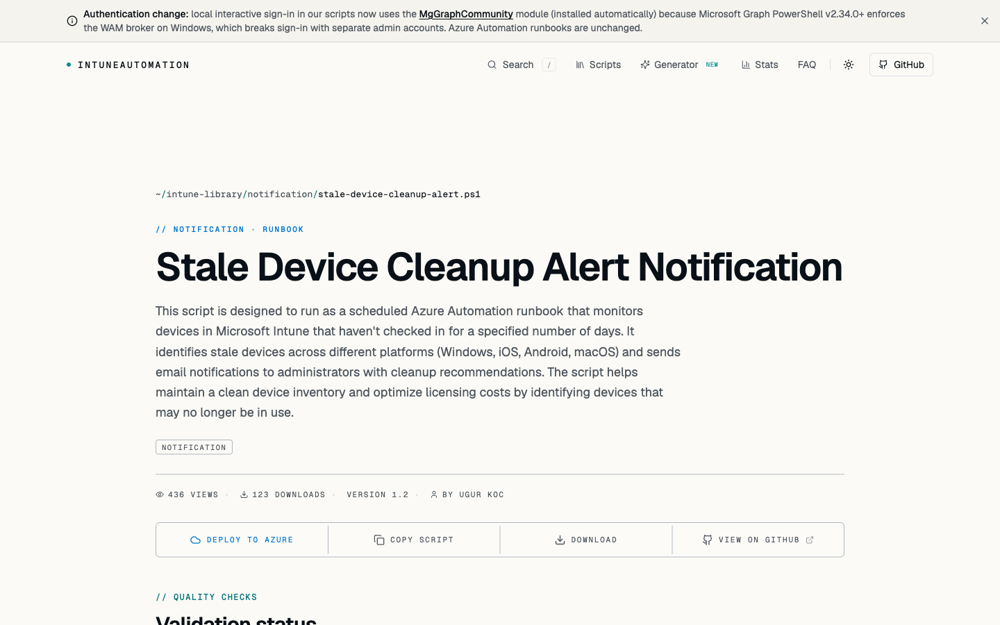

## Step 2: Deploy to Azure

Click **Deploy to Azure**. The Azure portal opens with a custom deployment form. The template is pre-filled with the runbook name and description; you only choose where it goes:

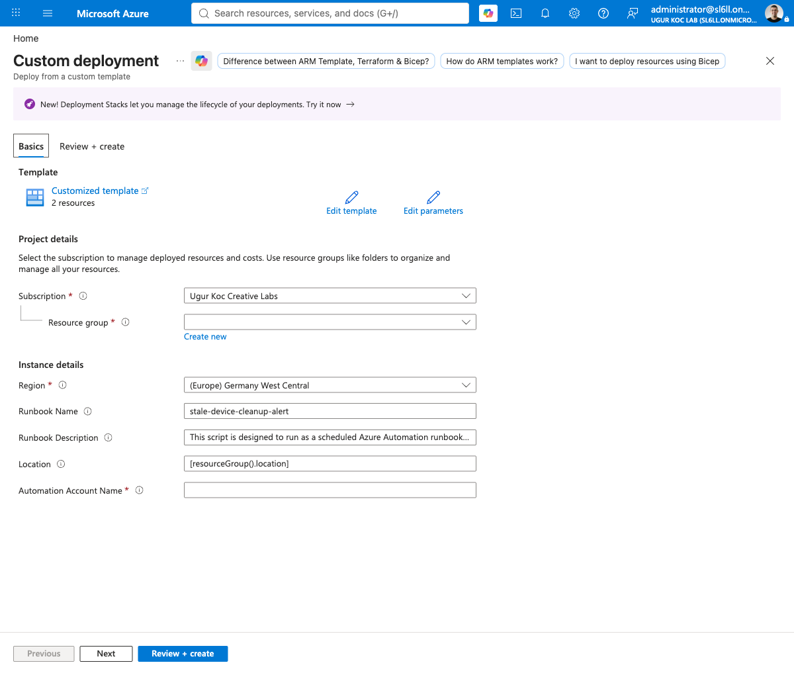

- **Subscription and Resource group**: create a dedicated resource group (for example `rg-intuneautomation-runbooks`) so all your runbook infrastructure lives in one place
- **Automation Account Name**: pick a name like `aa-intuneautomation-demo`. If you already have an Automation account you want to reuse, enter its exact name and resource group instead and the runbook is added to it

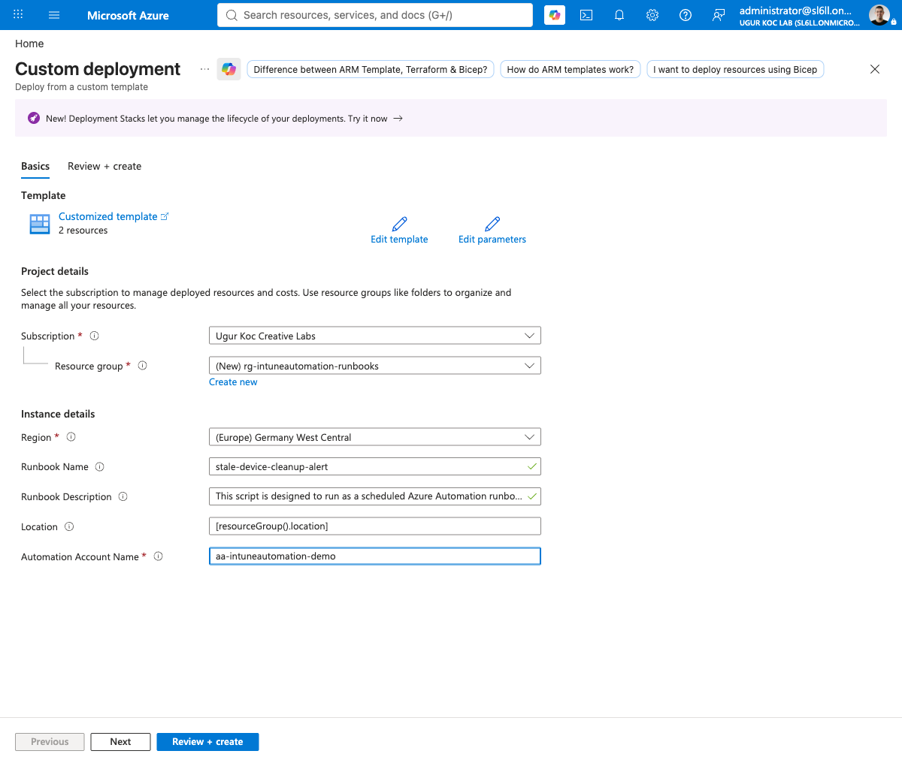

Click **Review + create**, check the summary, then **Create**:

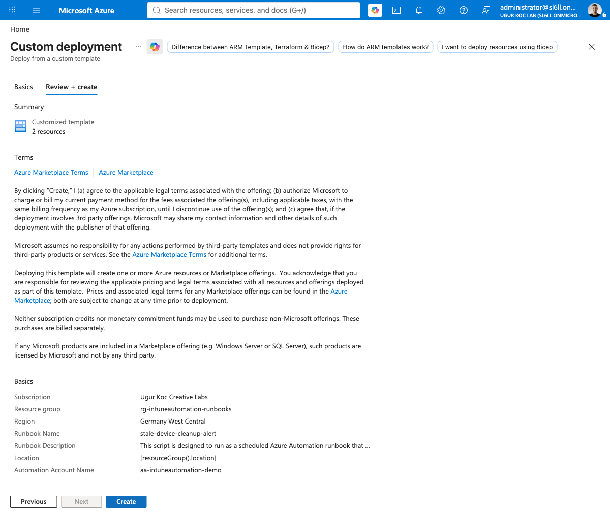

The template deploys two resources: the Automation account **with its system-assigned managed identity already enabled**, and the runbook with the script content imported from GitHub and published.

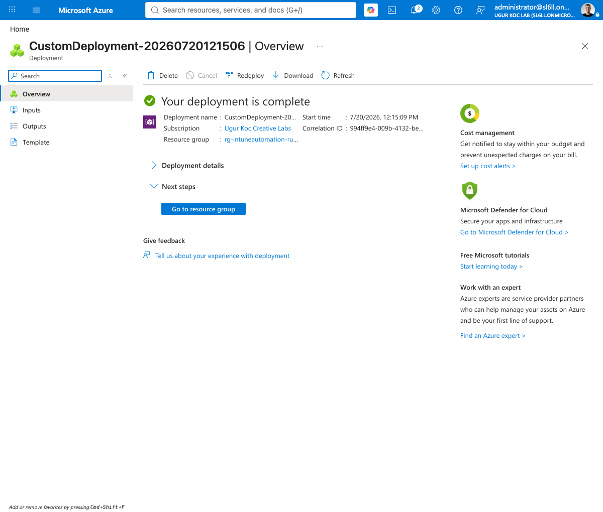

## Step 3: Find the managed identity

Open the new Automation account and go to **Account Settings > Identity**. The system-assigned identity is already **On** (the deployment template enables it). Copy the **Object (principal) ID** - you need it in the next step.

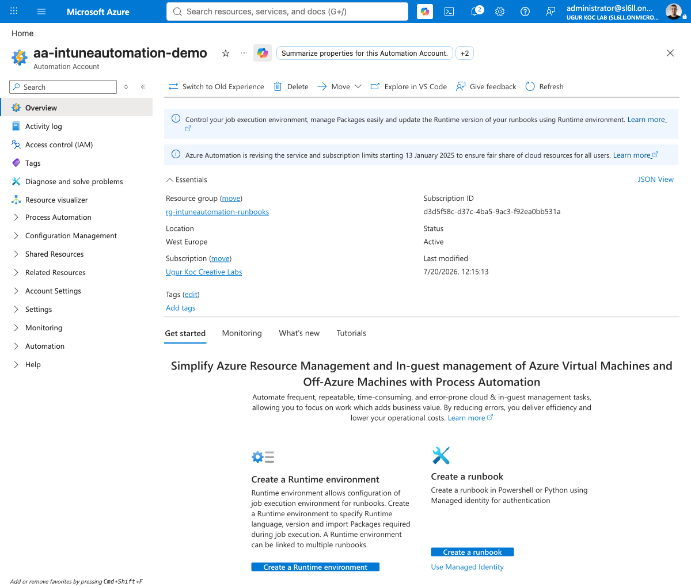

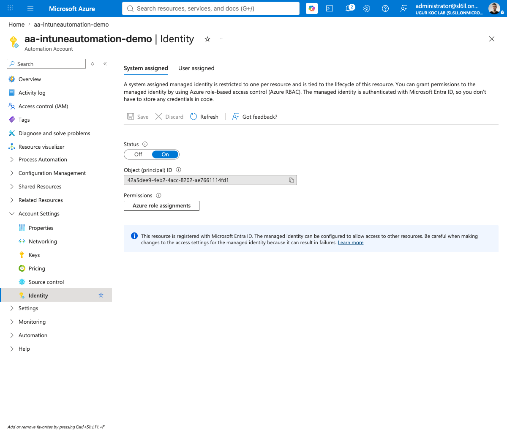

## Step 4: Grant Microsoft Graph permissions to the identity

This is the step everyone searches for, because **there is no portal UI for it**. Graph application permissions for a managed identity cannot be added through the App registrations blade; they are granted by creating app role assignments through the Graph API. The Azure portal's Cloud Shell is the fastest way because it already runs as you.

Open **Cloud Shell** from the portal header and run the following, replacing the identity name and the permission list with your script's `Required permissions`:

```bash
# Name of your Automation account (the managed identity has the same name)
IDENTITY_NAME="aa-intuneautomation-demo"

# The Graph permissions from the script page
PERMISSIONS="DeviceManagementManagedDevices.Read.All Mail.Send"

GRAPH_SP_ID=$(az ad sp show --id 00000003-0000-0000-c000-000000000000 --query id -o tsv)
MSI_ID=$(az ad sp list --display-name "$IDENTITY_NAME" --query "[0].id" -o tsv)

for PERM in $PERMISSIONS; do
  ROLE_ID=$(az ad sp show --id 00000003-0000-0000-c000-000000000000 \
    --query "appRoles[?value=='$PERM'].id" -o tsv)
  az rest --method POST \
    --url "https://graph.microsoft.com/v1.0/servicePrincipals/$MSI_ID/appRoleAssignments" \
    --headers "Content-Type=application/json" \
    --body "{\"principalId\":\"$MSI_ID\",\"resourceId\":\"$GRAPH_SP_ID\",\"appRoleId\":\"$ROLE_ID\"}"
done
```

Each successful grant returns a JSON object with your identity as `principalDisplayName` and `Microsoft Graph` as `resourceDisplayName`:

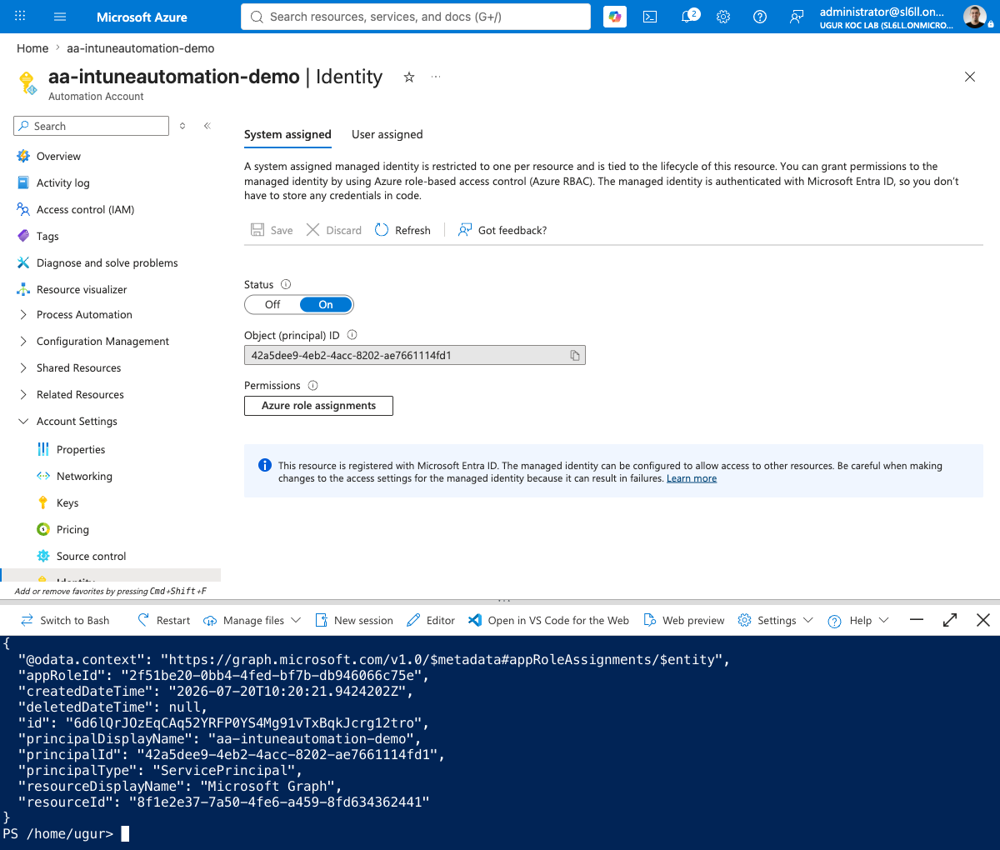

If you prefer PowerShell, the repository ships [grant-permissions-managed-identity.ps1](../grant-permissions-managed-identity.ps1) which does the same thing with a display-name parameter and a sensible default permission set.

### Verify the grant

Open **Microsoft Entra ID > Enterprise applications**, remove the application type filter, search for your Automation account name, and open **Security > Permissions**. Both permissions appear as Application type with admin consent:

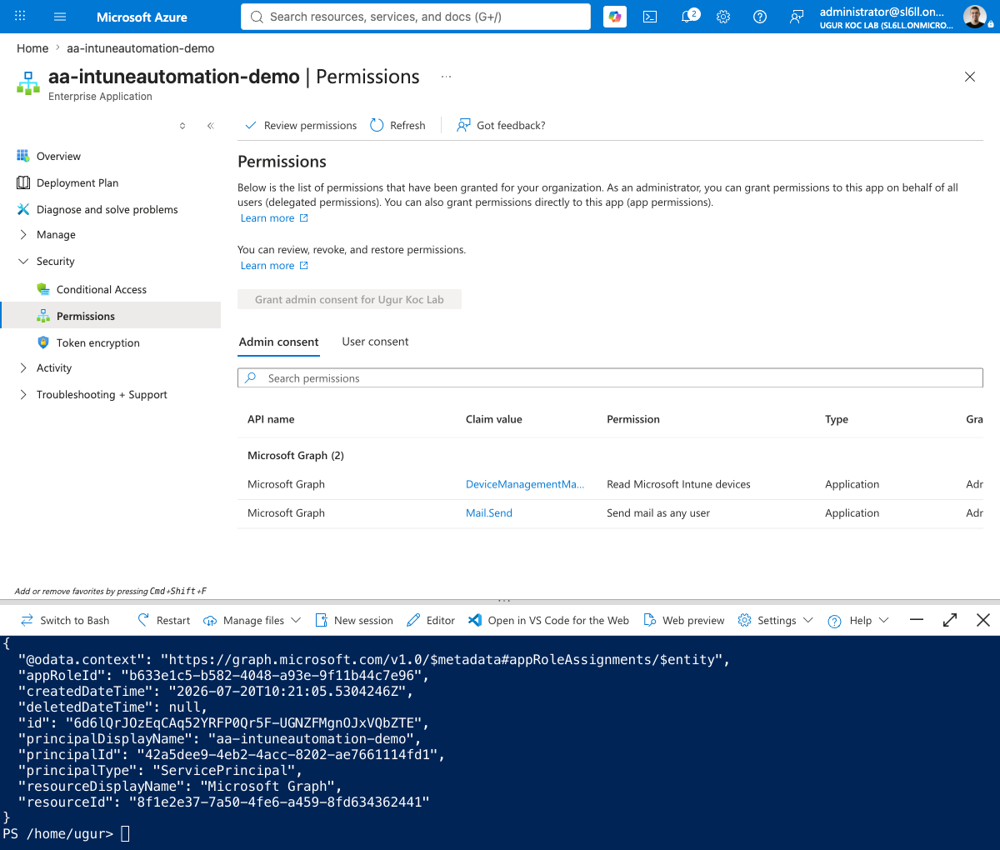

Least privilege matters here: grant only what the script's page lists, per script. `Mail.Send` as an application permission allows sending as any mailbox by default; if that is too broad for your tenant, scope it with an Exchange Online application access policy to the sender mailbox.

## Step 5: Import the Microsoft.Graph.Authentication module

The scripts need exactly one module in the Automation account: `Microsoft.Graph.Authentication`. In the portal: **Shared Resources > Modules > Add a module > Browse from gallery**, search for the module, and import it for the runtime your runbook uses (the deploy template creates PowerShell 5.1 runbooks).

Or do it from the same Cloud Shell session:

```powershell
New-AzAutomationModule -AutomationAccountName "aa-intuneautomation-demo" `
  -ResourceGroupName "rg-intuneautomation-runbooks" `
  -Name "Microsoft.Graph.Authentication" `
  -ContentLinkUri "https://www.powershellgallery.com/api/v2/package/Microsoft.Graph.Authentication"
```

The import takes a few minutes. Wait for `ProvisioningState: Succeeded` before starting the runbook:

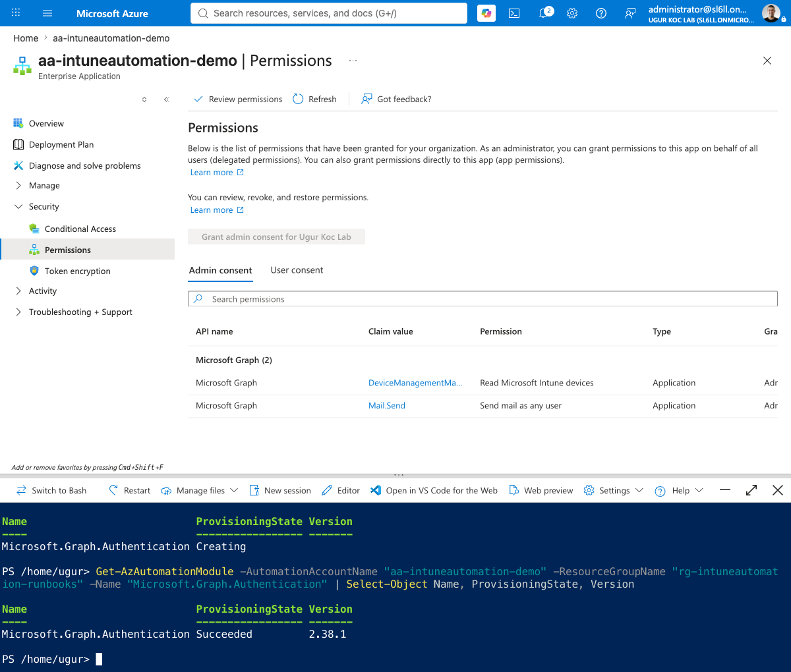

## Step 6: Run it

Open the runbook (Process Automation > Runbooks > your runbook) and click **Start**. The portal prompts for the script's parameters:

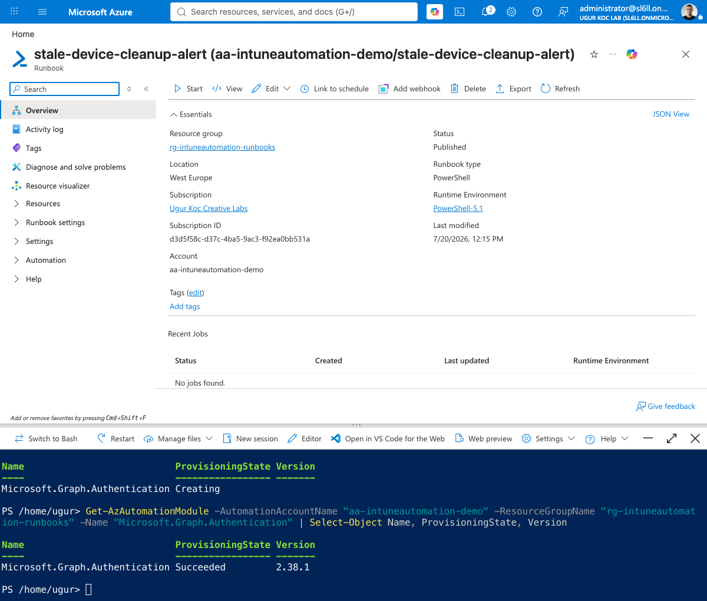

For the Stale Device Cleanup Alert:

- **StaleAfterDays**: `90`
- **EmailRecipients**: where the report goes
- **SenderUPN**: the licensed mailbox the mail is sent from (the managed identity needs Mail.Send for it)

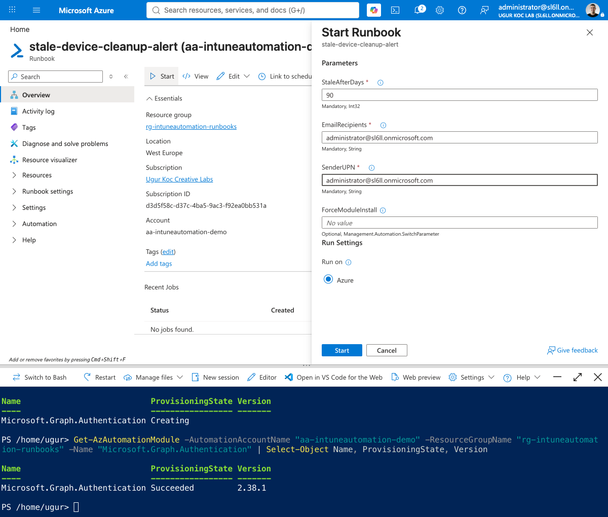

The job queues, spins up a sandbox (the first run in a fresh account takes a few minutes), and completes. The output shows the line that proves the whole setup:

```text
Running inside Azure Automation Runbook
Connecting to Microsoft Graph using Managed Identity...
Successfully connected to Microsoft Graph using Managed Identity
```

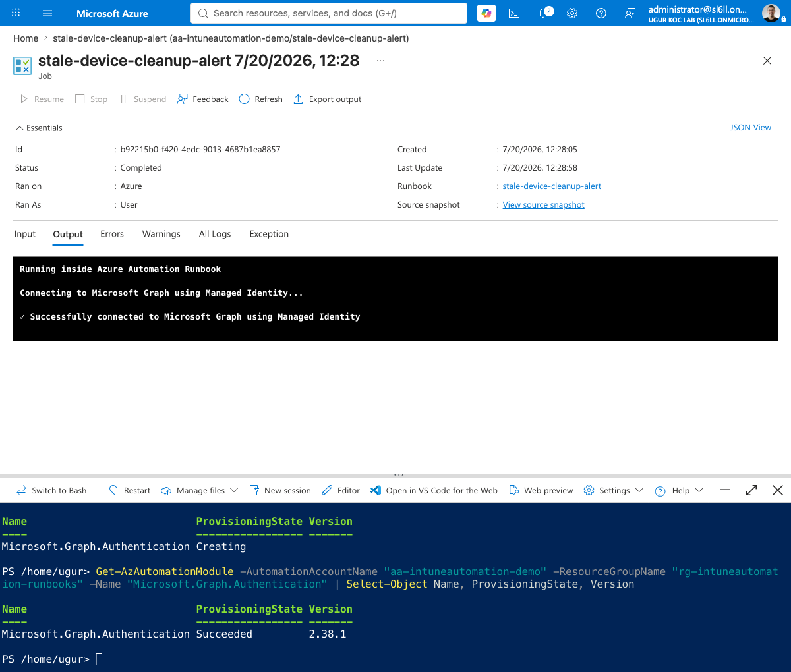

The **All Logs** tab confirms zero errors and zero warnings, and the alert email arrives in the recipient mailbox:

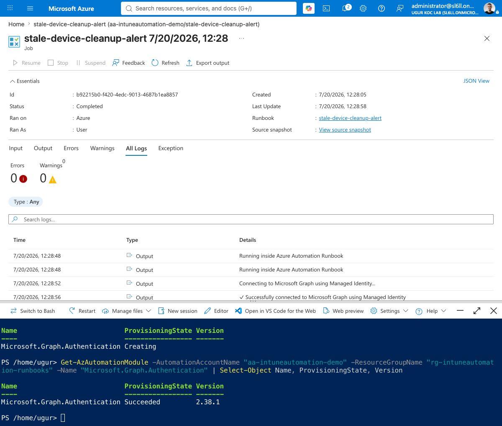

This is what lands in the inbox: the HTML report with the device inventory summary and the stale device details, sent from the SenderUPN mailbox by the managed identity:

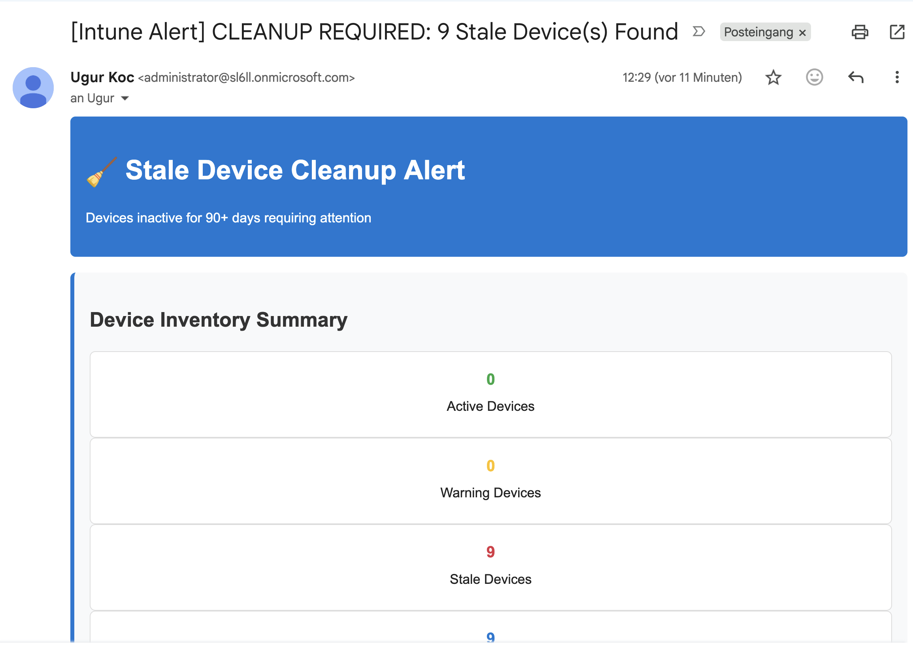

## Step 7: Schedule it

A report you run manually is a report you will forget. In the runbook, open **Resources > Schedules > Add a schedule**, create a recurring schedule (weekly fits most notification scripts), and bind the same parameters you used for the manual run. From then on the runbook runs unattended: no signed-in admin, no secrets, no expiring credentials.

## Troubleshooting

**Deployment fails with an Automation account quota error.** Subscriptions have a per-region quota for Automation accounts. Either deploy into an existing account (enter its name in the form) or change the **Location** parameter in the deployment form to a different region and redeploy. This happened in the real deployment behind this guide:

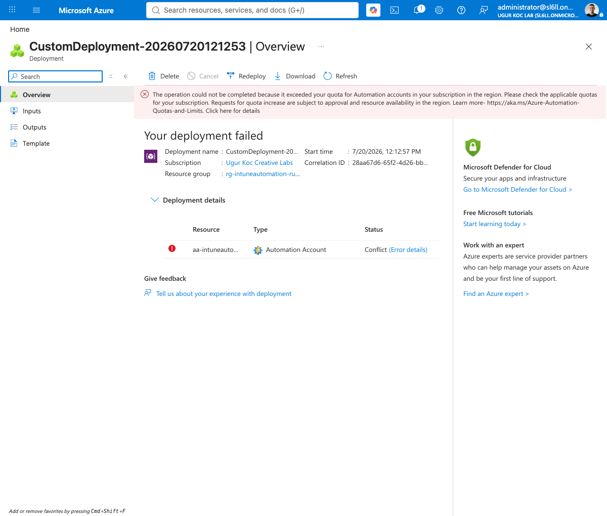

**Job fails with "Module 'Microsoft.Graph.Authentication' is not available".** The module import from step 5 has not finished (or was imported for a different runtime version). Check Modules for `Succeeded` state on the runtime your runbook uses.

**Job fails with "Insufficient privileges" or 403 from Graph.** Either a permission from the script page was not granted, or the grant has not propagated yet. Verify the Enterprise application's Permissions blade shows every scope, then allow a few minutes; newly granted app roles are not always honored by the very next token.

**Notification script fails on sending mail.** The `SenderUPN` mailbox must exist and be licensed, and the identity needs `Mail.Send`. The scripts send via `/users/{SenderUPN}/sendMail` because an app-only identity has no `/me`.

## Cleaning up

Everything created here lives in one resource group. Deleting the resource group removes the Automation account, the runbook, and the managed identity; deleting the identity's service principal automatically removes its permission grants.
